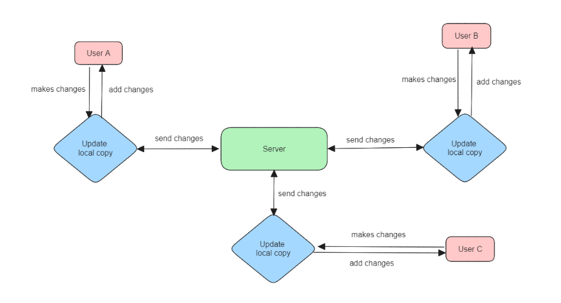

# Week-0 [03 June - 10 June] Setting up and The overview

## Project - Add real-time collaboration in Music Blocks

### Overview

Hi, I'm Ajeet Pratap Singh, a DMP intern. This summer, I'm excited to work on the project "Add Real-Time Collaboration in Music Blocks." The goal of this project is to implement comprehensive real-time collaboration features in Music Blocks, enabling users to create projects and learn together with their friends in real-time. Through this enhancement, we aim to make Music Blocks a more interactive and engaging platform for collaborative learning and creativity. 

### Setting up the project

Though I already have the project set up locally, I will ensure it remains up to date with the upstream. Before the coding period begins on June 11th, I'll be diving deep into the documentation of Music Blocks, Websockets, Yjs, and other relevant technologies. This will help me gain a solid understanding of the concepts and prepare for the development phase. 

## Final Objectives

Here are the objectives I aim to achieve by the end of the internship period:

1. Users will be able to initiate collaboration on a project.
2. Users will be able to invite their friends to collaborate on the project via a link.
3. Users and their peers will be able to collaborate on a project in real time with minimal latency.
4. When a user leaves, they will have a copy of the project saved locally with the latest synced changes.
5. When all users leave the room, the project will be saved to the server from the user who initiated it.

## Discussion with Mentors

My mentors for this project are Walter Bender and Devin Ulibarri. In a recent meeting, I discussed the prototype project and its implementation with Walter. Additionally, I had a meeting with Devin regarding the presentation of my project, which is scheduled for June 7, 2024, at 10:30 PM IST. [here](https://www.youtube.com/watch?v=PeIS3gXPFj0)

## Week-0 Objectives

This is the pre-coding period week. During this week, I will be developing a prototype of the project using the same technologies (Websockets and Yjs) proposed for the "Real-Time Collaboration" project. This prototype will provide us with a glimpse of the project's requirements and the implementation approach. Below is the architecture of the project that I'll be testing in the demo. 

